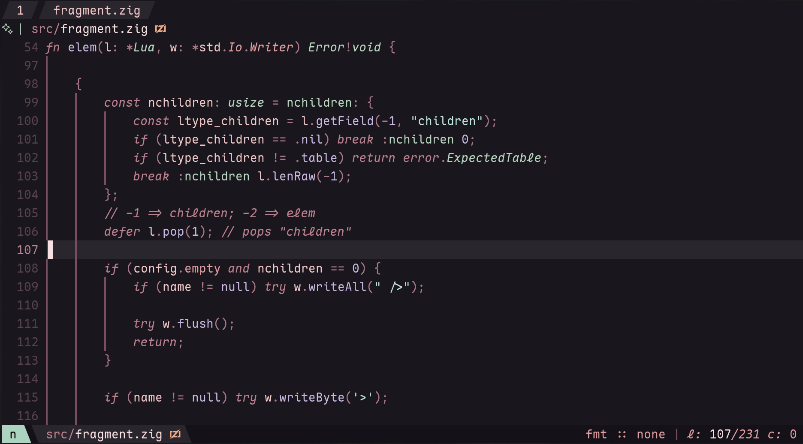

  <h2>mimi</h2>

amazing warm & fuzzy colorschemes.

mimi was inspired by [june][]'s cat.

  
  </img>

requires:

- [evergarden]; uses its modules as a colorscheme framework

[june]: https://koi.rip
[evergarden]: https://codeberg.org/evergarden/nvim

  
  </img>

